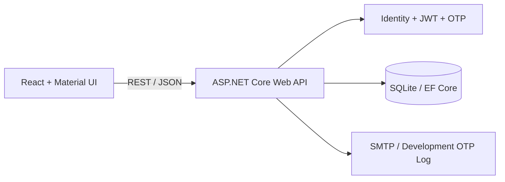

# ScoutBoard

[](https://github.com/jovan111111/scoutboard/actions/workflows/ci.yml)
[](https://dotnet.microsoft.com/)
[](https://react.dev/)
[](LICENSE)

ScoutBoard is a full-stack web application for discovering and evaluating amateur football players, clubs, matches, and local competitions in Novi Pazar and the surrounding region.

The project models a complete scouting workflow: players maintain their profiles and performance history, coaches manage clubs and trials, scouts create structured reports and watchlists, and administrators moderate clubs and users. The application interface is in Serbian, while the codebase and project documentation follow English naming and portfolio conventions.

## Highlights

- Secure account registration with six-digit email OTP verification
- JWT authentication and role-based authorization
- Player, coach/scout, and administrator roles
- Searchable player profiles with football-specific attributes
- Club registration and administrator approval workflow
- Player invitations and club membership management
- Match scheduling, results, player statistics, and performance ratings
- Player statistic correction requests with coach review
- Public and private scouting reports
- Private scout watchlists with workflow statuses and notes
- Competitions, seasons, participating clubs, and automatically calculated standings
- Football trials with player applications and coach decisions
- In-app notifications for important domain events
- Side-by-side player comparison with optional season filtering
- Responsive Material UI interface
- REST API documentation through Swagger/OpenAPI

## Technology Stack

### Frontend

- React 19
- Vite
- Material UI
- React Router
- Axios

### Backend

- ASP.NET Core Web API on .NET 10
- Entity Framework Core
- ASP.NET Core Identity
- JWT Bearer authentication
- SQLite
- MailKit for SMTP email delivery
- Swagger/OpenAPI

### Quality and Tooling

- xUnit unit and integration tests
- EF Core migrations
- Oxlint
- GitHub Actions continuous integration

## Architecture



The frontend and backend are independent applications. The React client communicates with the ASP.NET Core API through JSON endpoints, while authorization and business rules are enforced server-side. SQLite keeps local setup lightweight; the data layer is isolated through Entity Framework Core and can be migrated to another relational provider for deployment.

## Domain Overview

```text
User
├── Player profile
│   ├── Club memberships
│   ├── Match statistics
│   ├── Trial applications
│   └── Correction requests
├── Coach/scout
│   ├── Clubs and squad management
│   ├── Matches and player ratings
│   ├── Trials and application decisions
│   ├── Scouting reports
│   └── Private watchlist
└── Administrator
    ├── Club approval
    └── User account management
```

## Getting Started

### Prerequisites

- [.NET SDK 10](https://dotnet.microsoft.com/download)
- [Node.js](https://nodejs.org/) 22 LTS or newer
- Git

### 1. Clone the repository

```bash
git clone https://github.com/jovan111111/scoutboard.git
cd scoutboard
```

### 2. Start the API

```bash
dotnet tool restore
dotnet run --project backend/ScoutBoard.Api/ScoutBoard.Api.csproj --launch-profile http
```

The API starts at `http://localhost:5272`. Swagger UI is available at `http://localhost:5272/swagger`.

EF Core migrations and development seed data are applied automatically when the application starts.

### 3. Start the frontend

Open a second terminal:

```bash
cd frontend/scoutboard-client
npm install
npm run dev
```

The frontend starts at `http://localhost:5173`.

To use a different API address, copy `.env.example` to `.env` and update `VITE_API_URL`.

## Demo Accounts

Development accounts are created only when the API runs in the Development environment.

| Role | Email | Password |
| --- | --- | --- |
| Administrator | `admin@scoutboard.rs` | `Admin123!` |
| Coach/scout | `trener@scoutboard.rs` | `Trener123!` |
| Player | `igrac1@scoutboard.rs` | `Igrac123!` |

Two additional player accounts are available as `igrac2@scoutboard.rs` and `igrac3@scoutboard.rs`, using the same player password.

These credentials and the development JWT key are intentionally limited to local demonstration. Production secrets must be supplied through environment variables or a secrets manager.

## Authentication Flow

1. A player or coach/scout submits the registration form.
2. The API creates an unverified Identity account and generates a hashed, time-limited OTP.
3. In development mode, the six-digit OTP is written to the API console. With SMTP configured, it is sent by email.
4. The user verifies the email address with the OTP.
5. A successful login returns a signed JWT containing the user identity and role.
6. The React client sends the token in the `Authorization: Bearer <token>` header for protected requests.

OTP codes expire after 10 minutes and are limited to five verification attempts.

## Email Configuration

Development mode logs OTP codes to the API console. To send real emails, configure the following environment variables:

```text
Email__DevelopmentMode=false
Email__Host=smtp.example.com
Email__Port=587
Email__Username=your-username
Email__Password=your-password
Email__FromEmail=noreply@example.com
```

Never commit SMTP credentials or production JWT signing keys.

## Testing and Validation

Run backend checks from the repository root:

```bash
dotnet build ScoutBoard.slnx
dotnet test ScoutBoard.slnx
dotnet format ScoutBoard.slnx --verify-no-changes
```

Run frontend checks:

```bash
cd frontend/scoutboard-client
npm ci
npm run lint
npm run build
```

The test suite covers OTP verification, JWT claims and expiration, database constraints, and the complete registration → OTP → login → protected API flow.

## Project Structure

```text
scoutboard/
├── backend/
│   ├── ScoutBoard.Api/
│   │   ├── Controllers/
│   │   ├── Data/
│   │   ├── DTOs/
│   │   ├── Migrations/
│   │   ├── Models/
│   │   └── Services/
│   └── ScoutBoard.Tests/
├── frontend/
│   └── scoutboard-client/
│       └── src/
│           ├── api/
│           ├── components/
│           ├── context/
│           ├── pages/
│           ├── theme/
│           └── utils/
├── ScoutBoard.slnx
└── dotnet-tools.json
```

## API Areas

The API is organized around the following resources:

- `/api/auth`
- `/api/players`
- `/api/clubs`
- `/api/matches`
- `/api/competitions`
- `/api/tryouts`
- `/api/scouting-reports`
- `/api/watchlist`
- `/api/correction-requests`
- `/api/notifications`
- `/api/admin`

Use Swagger UI for the complete endpoint list, request schemas, and JWT authorization support.

## Deployment Notes

The repository is currently optimized for local development and demonstration. A production deployment should provide:

- a strong JWT signing key through environment configuration;
- real SMTP credentials;
- HTTPS and restricted CORS origins;
- persistent storage or a managed relational database;
- production logging and backups;
- disabled development seed data.

## License

This project is available under the [MIT License](LICENSE).
